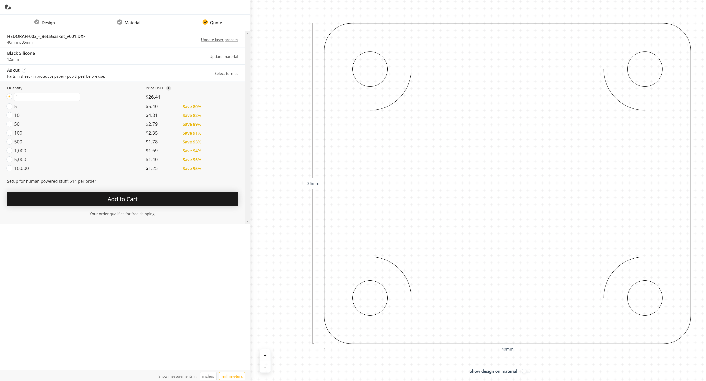
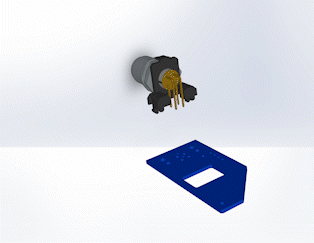
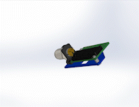

# Type: Atmospheric CO2
# Make: GEMS
# Model(s): Hedorah-NDIR v1.0

#### [NDIR_SensorInterface_1v0](NDIR_SensorInterface_1v0.mnt) 
Position file for surface mount parts

#### [NDIR_SensorInterface_1v0_2021-05-12](NDIR_SensorInterface_1v0_2021-05-12.zip)
Gerber files for Haar PCB

#### [NDIR_SensorInterface_1v0_BoM](NDIR_SensorInterface_1v0_BoM.csv)
Bill of Materials for PCB assembly 

#### [Hedorah-NDIR_Assembly_BoM](Hedorah-NDIR_Assembly_BoM.csv)
Bill of Materials for system assembly

#### [HedorahBetaBody_v001](HedorahBetaBody_v001.zip)
Zip file of STL for Hedorah body.

#### [HedorahBetaLid_v000](HedorahBetaLid_v000.zip)
Zip file of STL for Hedorah lid.

#### [HedorahBetaGasket_v001](HedorahBetaGasket_v001.zip)
Zip file of STL for Hedorah gasket.

## Body

__Manufacturer:__ Hubs (Formerly known as 3D Hubs)

__Process:__ SLS

__Material:__ HP PA 12 Nylon, __white__

__File:__ [HedorahBetaBody_v001](HedorahBetaBody_v001.zip) - Unzip before submitting 

## Lid

__Manufacturer:__ Hubs (Formerly known as 3D Hubs)

__Process:__ SLS

__Material:__ HP PA 12 Nylon, __white__

__File:__ [HedorahBetaLid_v000](HedorahBetaLid_v000.zip) - Unzip before submitting 

## Gasket

__Manufacturer:__ Ponoko

__Material:__ Black Silicone, 1.5mm

__File:__ [HEDORAH-003_-\_BetaGasket_v001](HEDORAH-003_-_BetaGasket_v001.dxf) - Inside zip file

See ordering example below

## PCB

- FR4
- 1oz copper
- Lead-Free HASL
- __Blue Soldermask__ 
- __White Silkscreen__ 
- 0.062" thickness

## Board Assembly

- Follow handling instructions outlines in [Senserion Handling Instructions For SHTxx Humidity and Temperature Sensors](https://sensirion.com/media/documents/6D95AA80/6374D8C1/Sensirion_Handling_Instructions_SHTxx.pdf)
- Any glue or conformal coating must be applied before CO2 sensor is attached to the board
- J2 can be soldered during the board assembly process **if verticality is maintained** 

Note: Pad `JP1` should be left _open_

# System Assembly

- Before Assembly: Conformal coat board using the protections described above
0. Insert `J1` connector until board guides click in, solder in place (only necessary if not done in board assembly process)
1. Insert `J2` into corresponding holes on assembled PCB
2. Pass fine screws through holes in CO2 sensor from top side
3. Place spacer on protruding screw
4. Pass screws through corresponding holes in PCB (ensure `J2` pins pass through CO2 sensor pads as well)
5. Tighten nuts onto bottom of protruding screws 
6. Solder `J2` to both the PCB and CO2 sensor
7. Remove jam nut from connector (`J1`) on Hedorah board assembly (if still in place)
8. Pass barrel of the M12 connector (`J1`) through the hole in the lid of the enclosure with the lid inset on the same side as the board
9. Tighten down jam nut from M12 connector (`J1`) to **1Nm** torque
10. Place gasket on corresponding lip on lid
11. Slide enclosure body over assembly so that gasket is placed between the sealing faces of the lid and the body
12. Screw in thread cutting screws through lid into body to secure the two together. Tighten to **0.9Nm** torque
13. Install goretex vents into far end of enclosure body. Tighten to **0.7Nm**

<!--  -->

	<b>CO2 Assembly (Steps 0-6):</b>
	 
	
	 
	<a href="./images/HedorahNDIR_Assembly_CO2.mp4">CO2 Sensor Assembly High Resolution Video</a>
<!-- [Download Video](./images/HedorahNDIR_Assembly_CO2.mp4) -->

<!--  -->
<!-- 
 -->
<!-- <body> -->
<!-- 
 -->
<!-- 
 -->
<!-- 
 -->

	<b>Enclosure Assembly (Steps 8-13):</b>
	 
	
	 	
	<a href="./images/HedorahNDIR_Assembly_Enclosure.mp4">Enclosure Assembly High Resolution Video</a>

<!-- 
 -->
<!-- </body> -->

<!-- [Download Video](./images/HedorahNDIR_Assembly_Enclosure.mp4) -->

Note: Step 7 is a precursor step to enclosure assembly video, not pictured